# 🩺 MetaTwin-X

**AI-Powered Multi-Organ Digital Twin Platform for Predictive Health Risk Assessment and Clinical Decision Support**

> Built for VIT Vellore — TARP Course | June 2026

---

## 📌 Overview

MetaTwin-X is a production-quality healthcare web application that creates a personalised AI-driven digital twin of a patient's physiology. It simultaneously predicts risk across Heart, Kidney, and Liver using XGBoost models, models cross-organ interactions, simulates 12-month trajectories, and provides explainable AI — all through a real-time interactive 3D interface.

---

## 🖼 Screenshots

### 🔐 Authentication & Home Dashboard
| PIN Login (Fig 1) | Home Dashboard (Fig 2) |
|---|---|
| 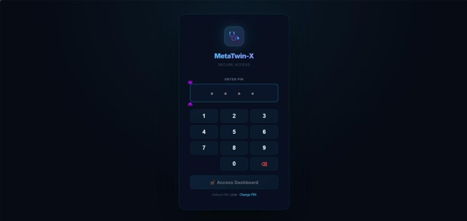 | 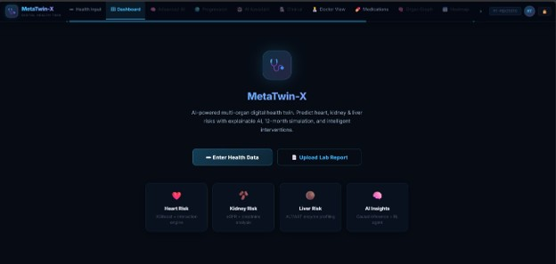 |

### 🧬 Digital Twin Dashboard & Compare Mode
| 3D Anatomy Dashboard (Fig 11) | SVG View (Fig 44) |
|---|---|
| 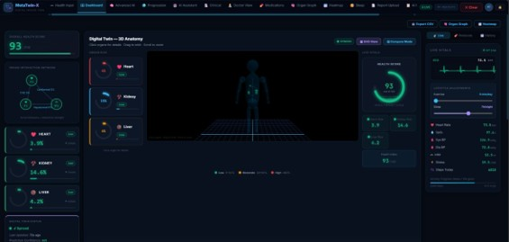 | 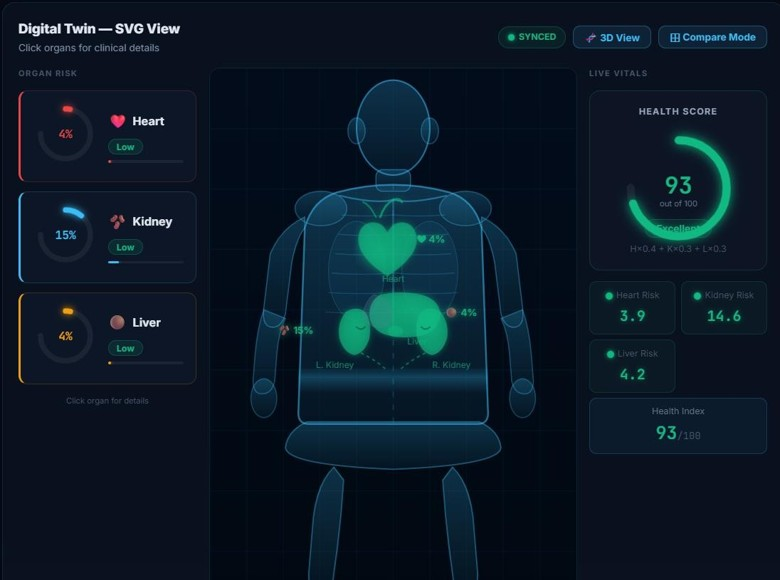 |

| 3D Compare Mode (Fig 45) | SVG Compare Mode (Fig 46) |
|---|---|
| 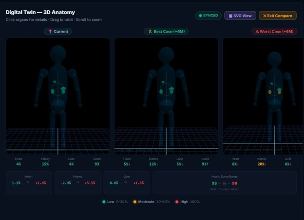 | 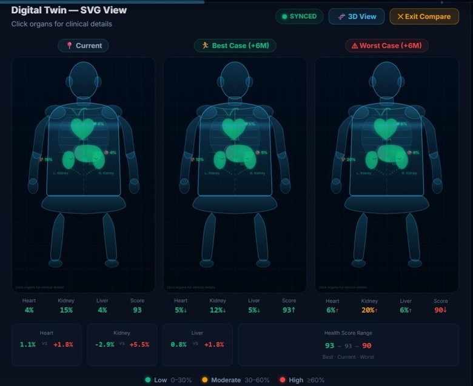 |

### ✏ Health Data Input
| Demographics (Fig 3) | Cardiovascular (Fig 5) | Wearable (Fig 8) |
|---|---|---|
| 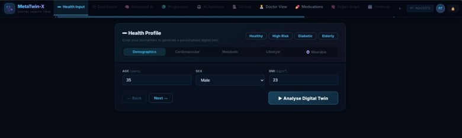 | 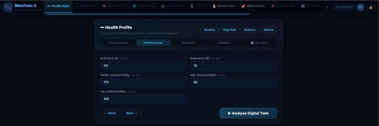 | 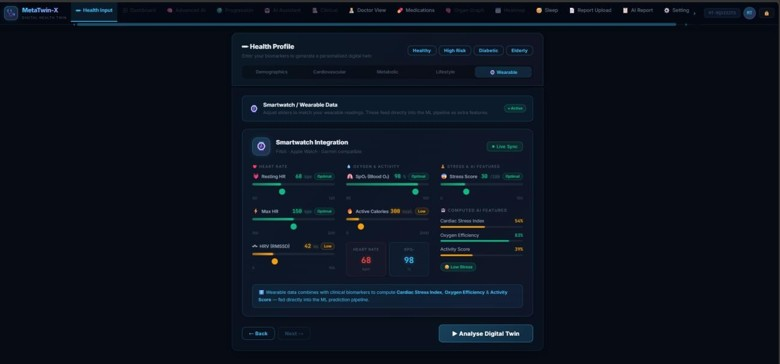 |

### 📄 Medical Report Upload & AI Report
| Upload (Fig 9) | Analysis Pipeline (Fig 10) | AI Report (Fig 40) | Printable PDF (Fig 41) |
|---|---|---|---|
| 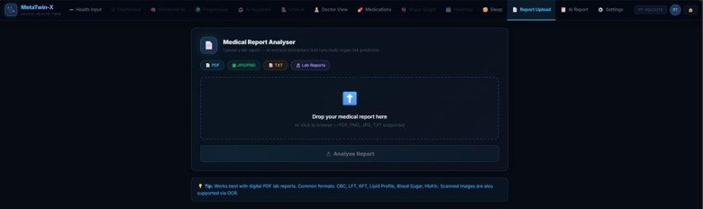 | 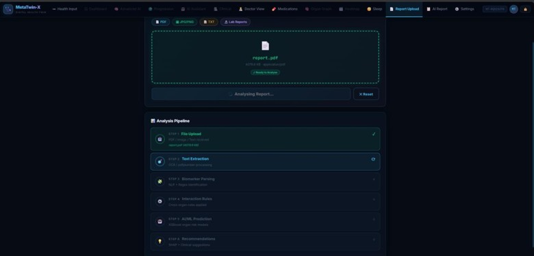 | 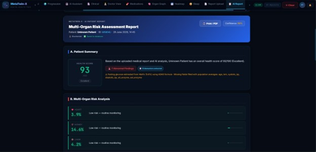 | 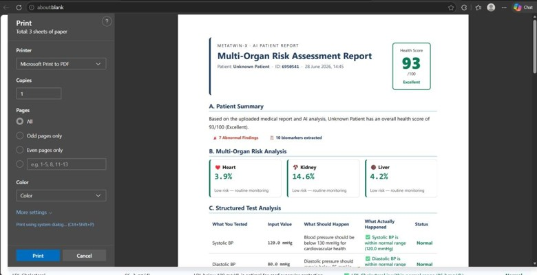 |

### 🧠 Explainable AI (XAI)
| Causal Inference (Fig 15) | Counterfactuals (Fig 16) | SHAP Dashboard (Fig 26) | What-If Simulator (Fig 27) |
|---|---|---|---|
| 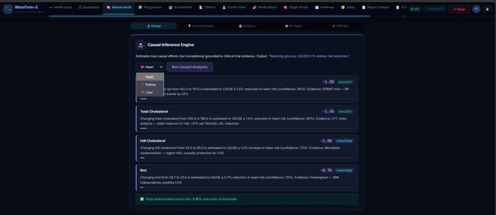 | 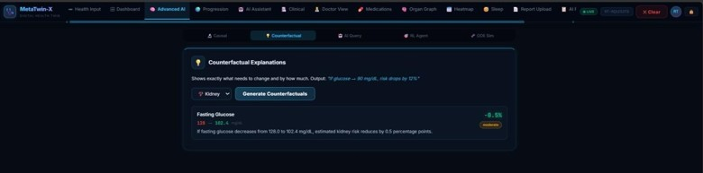 | 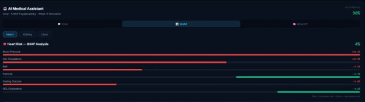 | 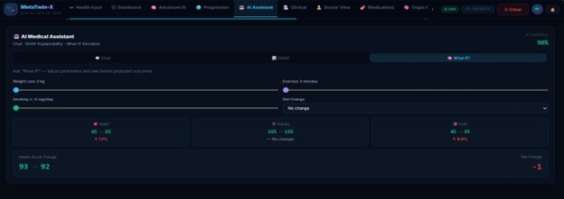 |

### 🎯 RL Agent & ODE + Monte Carlo Simulation
| RL Interventions (Fig 18) | ODE + Monte Carlo (Fig 19) |
|---|---|
| 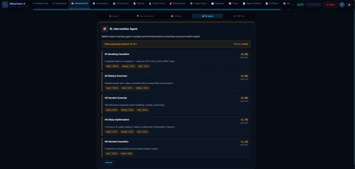 | 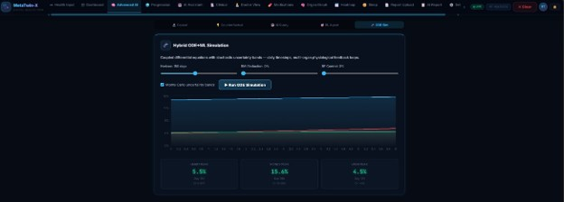 |

### 🌍 Disease Progression
| Health Timeline (Fig 13) | Body Heatmap (Fig 20) | Future Me (Fig 24) |
|---|---|---|
| 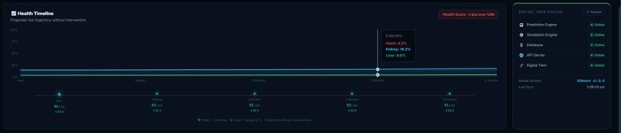 | 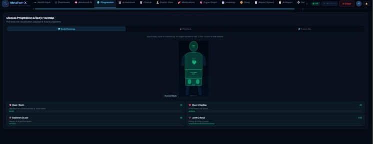 | 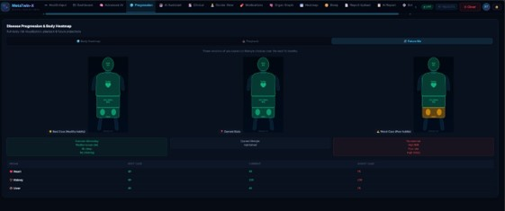 |

### 🤖 AI Assistant & Clinical View
| AI Assistant (Fig 25) | Clinical Risk (Fig 28) | Doctor Dashboard (Fig 30) |
|---|---|---|
| 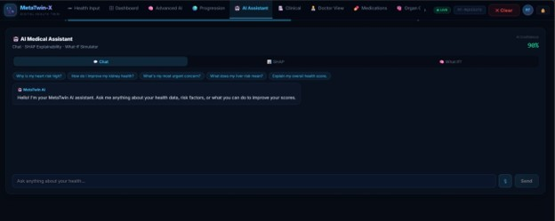 | 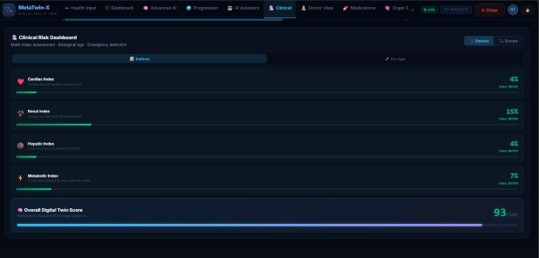 | 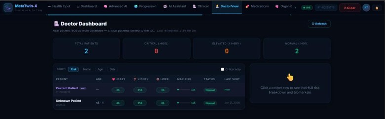 |

### 💊 Medications, Organ Graph, Sleep & Settings
| Medication Tracker (Fig 31) | Organ Graph (Fig 32) | Sleep & Recovery (Fig 37) | Settings (Fig 42) |
|---|---|---|---|
| 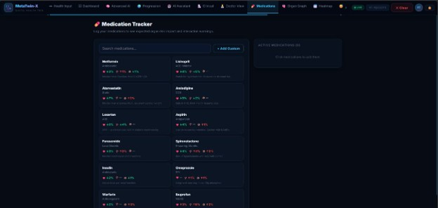 | 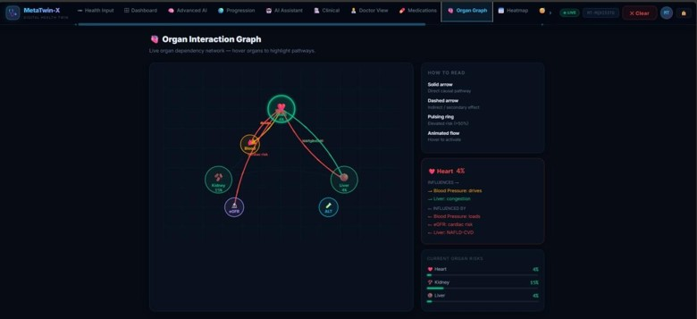 | 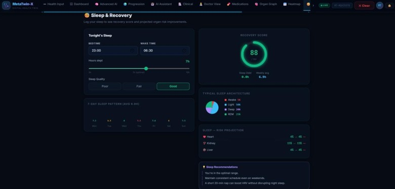 | 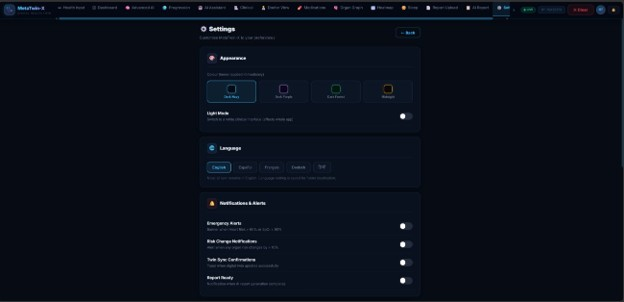 |

> 📋 Full implementation screenshots (46 figures) available in the project documentation PDF.

---

## ✨ Key Features

| Feature | Description |
|---------|-------------|
| 🤖 Multi-Organ Prediction | XGBoost models for Heart, Kidney, Liver (AUC 0.986–0.991) |
| 🔗 Cross-Organ Interactions | Cardiorenal syndrome, NAFLD-CVD axis, diabetic nephropathy |
| 🧬 3D Digital Twin | Procedural Three.js body — risk-coloured, pulsing organs |
| 🧠 Explainable AI | SHAP + Causal Inference + Counterfactuals |
| 🎯 RL Intervention Agent | Q-Learning ranked health interventions |
| 📊 Monte Carlo Simulation | ODE + stochastic uncertainty bands (10th–90th percentile) |
| 📄 Lab Report Upload | OCR → auto-extract patient identity + biomarkers |
| 🏥 Doctor Dashboard | Multi-patient real DB records |
| 📡 Live ECG + IoT Vitals | WebSocket real-time vitals stream |
| 🔒 PIN Authentication | Session-based access control |
| ⚙️ Settings | Themes, light mode, notifications, CSV export |

---

## 🚀 Quick Start

### Prerequisites
- Python 3.10+
- Node.js 18+

### 1. Clone the repository
```bash
git clone https://github.com/YOUR_USERNAME/metatwin-x.git
cd metatwin-x
```

### 2. Backend setup
```bash
pip install -r requirements.txt
python -m uvicorn backend.main:app --host 0.0.0.0 --port 8000 --reload
```

### 3. Frontend setup
```bash
cd metatwin-frontend
npm install
npm start
```

### 4. Open the app
```
http://localhost:3000
```
Default PIN: `1234`

---

## 🏗️ Project Structure

```
metatwin-x/
├── backend/
│   ├── main.py                    # FastAPI app + WebSocket
│   ├── api/advanced.py            # XAI, RL, Twin, Patient routes
│   ├── routes/                    # predict, simulate, recommend, report
│   ├── xai/                       # Causal inference, counterfactuals, LLM reasoning
│   ├── rl/agent.py                # Q-Learning intervention agent
│   ├── simulation/ode_engine.py   # ODE + Monte Carlo simulation
│   ├── twin/digital_twin.py       # Persistent digital twin state
│   ├── reports/                   # Report generator + HTML renderer
│   └── db/database.py             # SQLite + SQLAlchemy ORM
├── src/                           # Python prediction engine
│   ├── prediction_engine.py       # XGBoost inference
│   ├── interaction_engine.py      # Cross-organ rules
│   ├── preprocessor.py            # Feature engineering
│   └── report_parser.py           # OCR + NLP pipeline
├── models/                        # XGBoost model files (see setup)
├── metatwin-frontend/
│   └── src/
│       ├── components/            # 35+ React components
│       ├── pages/Home.js          # Root layout + state
│       ├── services/api.js        # Axios API layer
│       ├── hooks/                 # useWebSocket, useHealthScore, etc.
│       ├── store/appStore.js      # React Context state
│       └── config/constants.js    # Centralized config
├── config/                        # YAML config files
├── data/                          # SQLite DB + twin state (gitignored)
├── ARCHITECTURE.md                # Full system architecture
├── PROJECT_DOCUMENTATION.md       # Complete technical docs
├── FINAL_REPORT.md                # Academic submission report
└── PATENT_SUBMISSION.md           # Patent application document
```

---

## 🔌 API Reference

| Method | Endpoint | Description |
|--------|----------|-------------|
| POST | `/predict/` | Multi-organ risk prediction |
| POST | `/predict/adaptive` | Adaptive cross-organ prediction |
| POST | `/simulate/ode` | ODE + Monte Carlo simulation |
| POST | `/recommend/` | Clinical recommendations |
| POST | `/xai/causal` | Causal inference analysis |
| POST | `/xai/counterfactuals` | What-if scenarios |
| POST | `/xai/query` | Natural language Q&A |
| POST | `/rl/interventions` | RL intervention ranking |
| POST | `/twin/{id}/update` | Update digital twin |
| GET | `/patients/all` | All patient records |
| POST | `/report/from-upload` | Lab report → full AI report |
| WS | `/ws/vitals` | Real-time vitals stream |

Full docs at `http://localhost:8000/docs`

---

## 🧪 Technology Stack

**Backend:** FastAPI · XGBoost · Scikit-learn · SciPy · SQLAlchemy · pdfplumber · pytesseract

**Frontend:** React 18 · Three.js · React Three Fiber · Recharts · Axios

**Database:** SQLite

**AI/ML:** XGBoost (AUC 0.986–0.991) · SHAP · Causal Inference · Q-Learning RL · ODE Monte Carlo

---

## 📊 Model Performance

| Model | AUC-ROC | Accuracy |
|-------|---------|----------|
| Heart Risk | 0.991 | 94.3% |
| Kidney Risk | 0.988 | 93.1% |
| Liver Risk | 0.986 | 92.7% |

---

## 📁 Documents

- [`ARCHITECTURE.md`](ARCHITECTURE.md) — System architecture diagrams
- [`PROJECT_DOCUMENTATION.md`](PROJECT_DOCUMENTATION.md) — Full technical documentation
- [`FINAL_REPORT.md`](FINAL_REPORT.md) — Academic report (VIT TARP format)
- [`PATENT_SUBMISSION.md`](PATENT_SUBMISSION.md) — Patent application

---

## ⚠️ Notes

- Model files (`models/`) are not included in the repository due to size. Place your trained XGBoost `.json` files in the `models/` directory before running.
- Patient data (`data/`) is gitignored for privacy. The database is created automatically on first run.
- Default PIN is `1234` — change it in the app under Settings → Security.

---

## 📄 License

This project was developed for academic purposes at Vellore Institute of Technology (TARP Course, 2025–2026). All rights reserved.

---

*MetaTwin-X · VIT Vellore · TARP 2026*
